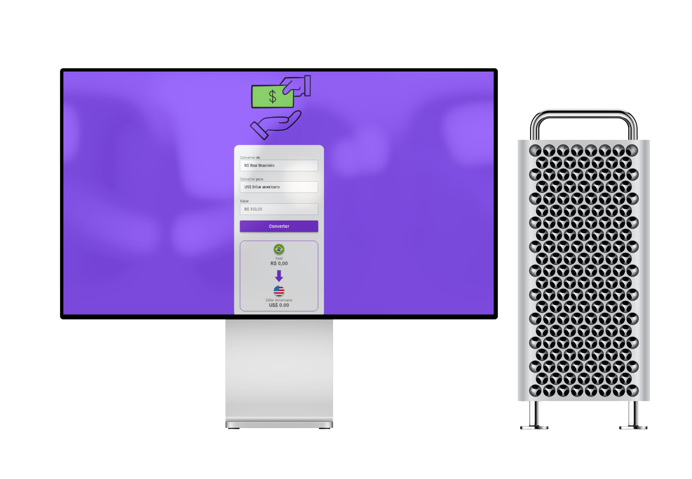

# Convert-Money

Este projeto é uma aplicação dinâmica voltada para a conversão de moedas, criada como parte da minha jornada de aprendizado em desenvolvimento web. A ideia principal foi unir teoria e prática, permitindo-me aprofundar conhecimentos em tecnologias fundamentais como HTML5, CSS e JavaScript, além de ganhar experiência no desenvolvimento de interfaces interativas e funcionais.

Ao longo do processo, busquei criar uma ferramenta intuitiva, que não apenas realiza cálculos precisos de conversão de moedas, mas também proporciona uma experiência agradável para o usuário. Além disso, o projeto me ajudou a explorar conceitos importantes, como manipulação de DOM, integração de APIs para obter taxas de câmbio atualizadas e boas práticas no design responsivo.

Esse projeto não apenas reforçou minha base técnica, mas também me desafiou a encontrar soluções criativas para problemas reais, contribuindo de forma significativa para minha evolução como desenvolvedor web.
  ## 📸 Page-Preview

   

 
## 👷🏻‍♀️ Tecnologias Utilizadas

- HTML
- CSS
- JavaScript

### 🚀Características

- Celular & Desktop Layouts
- Html Semantico
  

## 👩🏻‍💻 Autor

&nbsp;&nbsp;
&nbsp;&nbsp;

